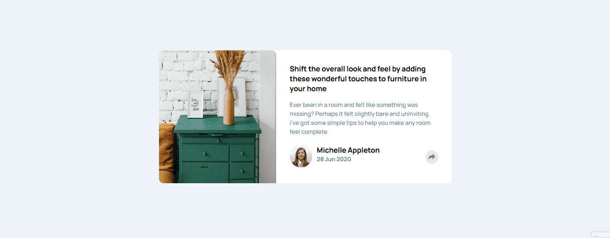

# Frontend Mentor - Article preview component

## Sumário

- [Visão geral](#visão-geral)
  - [Nota](#nota)
  - [O Desafio](#o-desafio)
  - [Screenshot](#screenshot)
- [Links](#links)
- [Meu processo](#meu-processo)
  - [Tecnologias](#tecnologias-usadas)
  - [O que eu aprendi](#o-que-aprendi)
  - [Dificuldades](#dificuldades)
- [Contato](#contato)

### Nota
Por se tratar de um desafio de um site em inglês resolvi codar em inglês, para praticar e manter o costume deste idioma.
  

### O Desafio

Os usuários devem ser capazes de:

- Interagir com o layout ideal para o aplicativo, dependendo do tamanho da tela do dispositivo;

- Ao clicar no botão de compartilhar, o usuário deve conseguir visualizar as redes sociais possíveis em que o artigo possa ser compartilhado.

### Screenshot

## Links

- Repositório: 
- Deploy: 

## Meu Processo

### Tecnologias usadas:

- HTML5 Semantico
- CSS3 responsivo
- Flexbox
- Grid
- Mobile First
- Javascript DOM

### O que aprendi?

- Pude consolidar ainda mais meus conhecimentos em HTML semântico, o poder das grouping tags de facilitarem a estruturação do projeto de forma semântica;  
- Também o CSS responsivo com Media Queries para gerar uma melhor experiência para o usuário, independendo do dispositivo. Flexbox, Grid elementos posicionados de forma rápida e prática. Modelo de Caixas. Tipografia. Displays ;  
- Pude também firmar mais meu conhecimento em manipulação do DOM do Javascript. O método toggle, foi uma novidade que aprendi e me facilitou muito em gerenciar classes CSS e manipular o display de determinados elementos;  
- Na versão desktop, a caixa com as redes sociais, possui uma espécie de seta, apontando para o botão. Tive que pesquisar como faze-lo, o resultado me fez ter gostado de ter aprendido algo novo.

### Dificuldades

Optei em utilizar o conceito Mobile First e com isso, tive moderada dificuldade com a estilização responsiva, tendo que utilizar além de flexbox, grid e as propriedades position.
O DOM javascript ainda me faz dedicar uma parte do tempo em manipular os elementos.

## Contato

- Github - [mazziera.io](https://github.com/mazziera)
- Frontend Mentor - [@mazziera](https://www.frontendmentor.io/profile/mazziera)
- Linkedin - [@raphael-mazzieri](https://www.linkedin.com/in/raphael-mazzieri/)